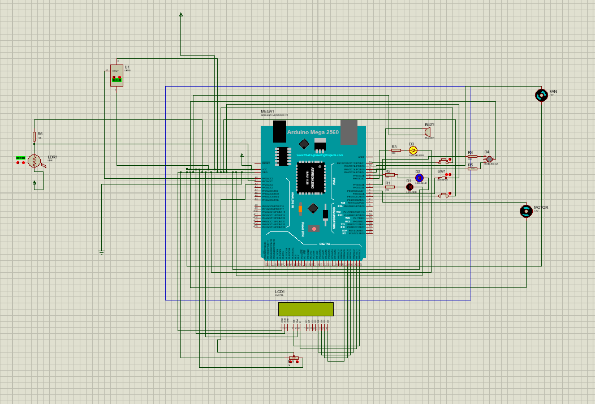

# ardunio-vehicle-system
Arduino based Smart Vehicle Security System

# Arduino-Based Vehicle Security and Control System Simulation  
*A Proteus simulation of smart car features (security, comfort controls) using Arduino Mega 2560.*  

---

## 📌 Project Overview  
This project simulates modern vehicle security and comfort systems using **Arduino Mega 2560** and **Proteus**. Key features include:  
- 🚗 **Engine start control** (with seatbelt interlock)  
- 🌡️ **Automatic temperature control** (AC triggers at 25°C)  
- 💡 **Automatic headlights** (LDR-based)  
- ⛽ **Fuel level warning** (simulated via potentiometer)  
- 🚪 **Door status monitoring** (engine lock if door is open)  

---

## 🛠️ Components  
### Hardware  
- **Microcontroller:** Arduino Mega 2560  
- **Sensors:** LM35 (temperature), LDR (light), potentiometer (fuel level)  
- **Actuators:** LEDs, buzzer, DC motor (fan), LCD (16x2)  
- **Inputs:** Push buttons (engine start, seatbelt, door switch)  

### Software  
- Arduino IDE  
- Proteus 8 Professional  

---

## 🔌 Circuit Diagram  
  
*Fig. 1: Proteus simulation setup*  

---

## ⚙️ Functionality  
| Feature               | Logic                                                                 |  
|-----------------------|-----------------------------------------------------------------------|  
| **Engine Start**      | Blocks if seatbelt is unbuckled or door is open (buzzer + LED alert)  |  
| **Temperature Control** | Activates fan if temperature > 25°C (LM35 sensor)                   |  
| **Headlights**        | Auto ON/OFF based on LDR readings (threshold: 250)                   |  
| **Fuel Warning**      | Yellow LED + LCD alert if fuel ≤ 10%                                 |  

---
